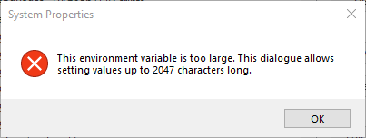

# PATH Editor

A simple Python-based graphical user interface (GUI) tool for managing your Windows PATH environment variable with a user-friendly way to view, add, edit, delete, and reorder individual entries in both the User and System PATH variables, with an inbuilt ability to handle >2047 character PATHs.

**Created by:** MattFor - mattfor@relaxy.xyz


Keep getting this error? I'm here to fix that!




## Features

* View User and System PATH entries in a clear, list format.
* Add new directories to the PATH.
* Edit existing PATH entries.
* Delete unwanted PATH entries.
* Reorder PATH entries (move up/down).
* Save and restore PATH configurations to/from a JSON file.
* Checks for administrator privileges when attempting to modify the System PATH.

## Requirements

* Python 3.6 or higher (with Tkinter included).
* Windows operating system.

## Installation

1.  Ensure you have Python installed. If you encountered issues with Tkinter previously, make sure to select the "tcl/tk" or "GUI support" option when installing or modifying your Python installation.
2.  Save the provided Python script as `main.py`.
3.  (Optional but Recommended) Create a Python virtual environment in the project directory:
    ```bash
    python -m venv .venv
    ```
4.  Activate the virtual environment:
    * On Windows Command Prompt:
        ```bash
        .venv\Scripts\activate
        ```
    * On Windows PowerShell:
        ```powershell
        .venv\Scripts\Activate
        ```
5.  No external Python packages are strictly required beyond the standard library (`tkinter`, `os`, `json`, `datetime`, `winreg`, `ctypes`).

## Usage

1.  Open your terminal.
2.  Navigate to the directory that has `main.py`.
3.  If you created a virtual environment, activate it (see Installation steps).
4.  Run the script using your Python interpreter:
    ```bash
    python main.py
    ```
    If you compiled it to an executable using PyInstaller (`pyinstaller --onefile --noconsole main.py`)

    [**Which I HIGHLY recommend btw**], you can run the executable directly from the `dist` folder.

5.  Select whether you want to edit the "User" or "System" PATH variable using the radio buttons.
6.  Use the buttons ("Add", "Edit", "Delete", "Up", "Down") to manage the PATH entries in the list.
7.  Use "Save PATH to File" and "Restore from File" for backup purposes.
8.  Click "Save" to apply your changes to the selected PATH variable. Note that modifying the System PATH requires administrator privileges.
9.  Click "Cancel" to close the application without saving.

## License

This software is provided under a **Proprietary License**.

You are not permitted to distribute, modify, or create derivative works of this Software, in whole or in part, without express written permission from the copyright holder, MattFor.

Please refer to the `LICENSE` file in this repository for the full terms. ;)
